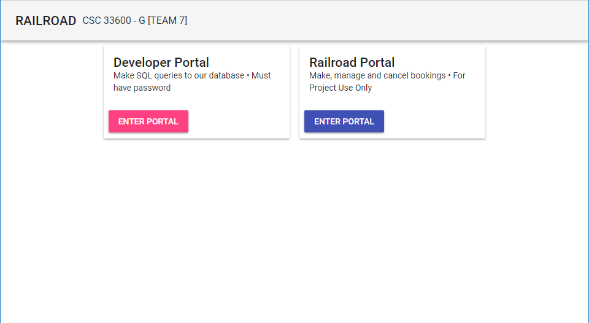

# Node-MariaDB
Databases Railroad Project for **CSC 33600 - G @ CCNY** for **Professor Peter Barnett**

### Technologies

This project was hosted on Google Cloud, technologies used:
1. MariaDB 
2. NodeJS
3. Socket.io (NodeJS Lib.)
4. ReactJS (Front-End)
5. Material-UI (https://material-ui-next.com/)

This project aims to represent a working railroad system.

### Screenshots

